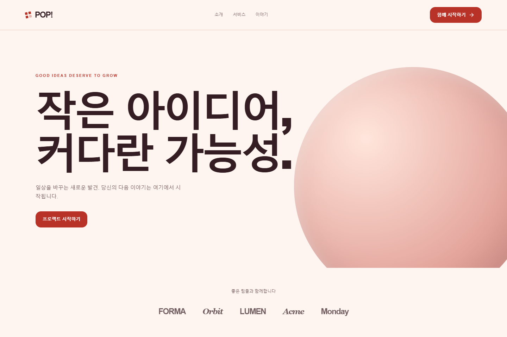
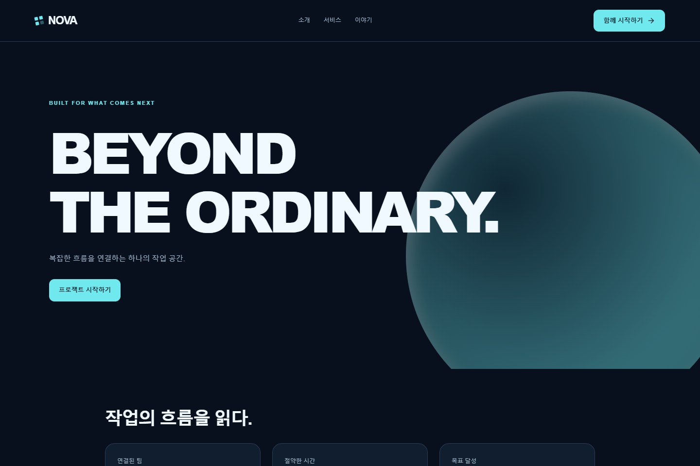
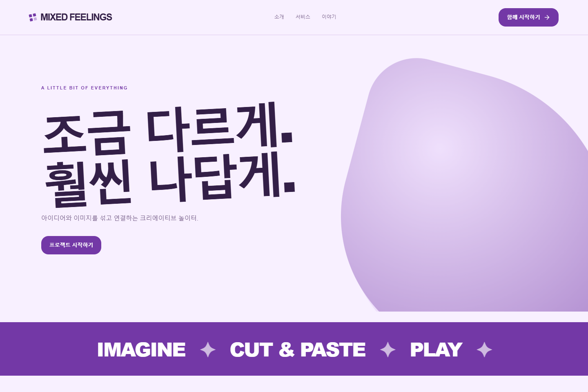
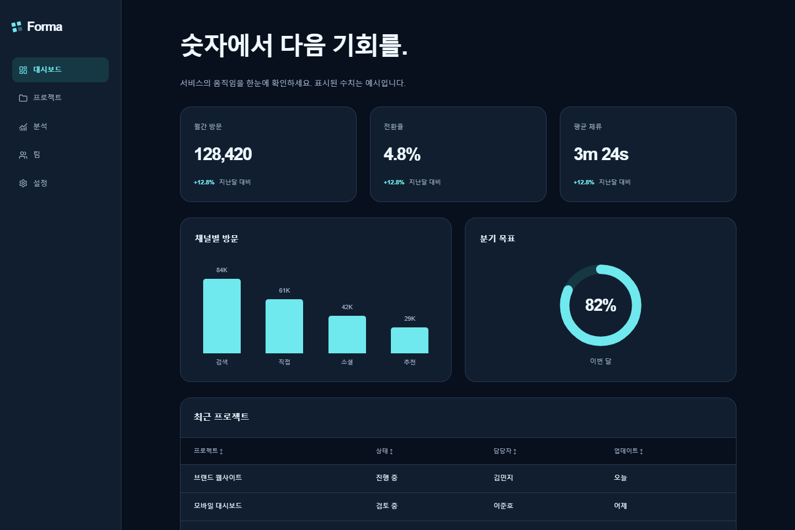

# Prompt Studio

**눈으로 UI를 조립하고, 완성한 설계를 AI에 전달하세요.**

Prompt Studio는 디자인 용어를 몰라도 작은 화면 예시를 보고 컴포넌트를 고를 수 있는 웹 UI 설계 도구입니다. 프리셋에서 시작해 레이아웃과 테마를 수정하고, 반응형 화면을 확인한 뒤 외부 코딩 AI에 프롬프트와 설계 파일을 전달합니다.

[라이브 데모](https://prompt-studio-design.gptpro2908176.chatgpt.site/) · [시작하기](docs/GETTING_STARTED.md) · [사용 가이드](docs/USER_GUIDE.md) · [전체 문서](docs/README.md)

**로그인 없이 사용 · 브라우저에 저장 · API 키 불필요 · 정적 배포**

## 화면 미리보기

아래 이미지는 제공되는 프리셋을 실제 렌더러로 캡처한 화면입니다. 프리셋의 문구·요소·배치·테마는 모두 수정할 수 있습니다.

| 컬러 팝 랜딩                                                      | 다크 테크                                                         |
| ----------------------------------------------------------------- | ----------------------------------------------------------------- |
|         |         |
| **콜라주 크리에이터**                                             | **애널리틱스 보드**                                               |
|  |  |

## 무엇을 할 수 있나요?

| 기능                       | 현재 제공 범위                                                            |
| -------------------------- | ------------------------------------------------------------------------- |
| 시각적 컴포넌트 라이브러리 | 삽입 가능한 56종, 작은 그림·쉬운 설명·직접 조작하는 큰 미리보기           |
| 편집 가능한 시작 화면      | 프리셋 15종 + 빈 화면, 용도별 분류와 데스크톱·태블릿·모바일 미리보기      |
| 테마                       | 라이트·다크 색상을 가진 테마 12종, 색상·서체 계열·밀도·모서리 조절        |
| 페이지와 레이아웃          | 다중 페이지, 중첩 구조, Flex/Grid, 줄바꿈·너비·여백·정렬·화면별 변경      |
| 반응형 확인                | 390·768·1440px 및 사용자 지정 320~2560px, 화면 폭과 확대 배율 분리        |
| 저장과 복구                | IndexedDB 자동 저장, JSON 백업·복원, 버전 보관, 탭 충돌 감지, 미저장 복구 |
| 공유                       | 읽기 전용 URL 스냅샷과 받는 사람의 로컬 사본 만들기                       |
| AI 전달                    | 프롬프트, 구조 명세, 디자인 토큰, 컴포넌트 동작, 참고 CSS, PNG, ZIP       |

검색·탭·표 정렬·달력·팝업 등을 미리보기에서 조작할 수 있습니다. 채팅 응답과 폼 제출은 샘플 동작이며 실제 인증·결제·이메일·서버 저장은 연결되어 있지 않습니다.

## 사용 흐름

1. **프리셋 선택** — 큰 미리보기에서 화면 크기를 바꿔 보고 시작합니다.
2. **컴포넌트 조립** — 그림을 보고 요소를 추가하고 레이어와 속성을 수정합니다.
3. **테마 조정** — 프로젝트 전체 색상·서체·간격을 바꿉니다.
4. **반응형 확인** — 여러 화면 폭에서 배치와 동작을 확인합니다.
5. **AI 전달** — 프롬프트나 ZIP을 외부 코딩 AI에 제공해 프론트엔드를 구현합니다.

AI 호출은 앱 내부에서 실행하지 않습니다. 출력물은 완성된 앱 코드가 아닌 **구현을 위한 설계 자료**입니다.

## 빠른 실행

검증에 사용한 환경은 **Node.js 24.14.0 / npm / Windows**입니다. `package-lock.json`을 포함하며 설치에 앱 API 키나 환경 변수는 필요하지 않습니다.

```sh
npm ci
npm run dev
```

브라우저에서 [localhost:3000](http://localhost:3000)을 엽니다. 정적 빌드 확인:

```sh
npm run build
npm start
```

`npm start`는 `out/`을 [localhost:3200](http://localhost:3200)에서 제공하는 로컬 확인용 서버입니다. 공개 서비스에는 `out/`을 정적 호스팅에 배포합니다. 자세한 내용은 [설치](docs/GETTING_STARTED.md)와 [배포](docs/DEPLOYMENT.md)를 참고하세요.

## 기술 구성

Next.js 16.3.7 · React 19.2.8 · TypeScript · Tailwind CSS 4 · Zod · IndexedDB · Playwright

```text
src/app/          라우트와 정적 앱 진입점
src/builder/      현재 편집기·문서 모델·렌더러·저장·AI 전달
src/components/   보존된 기존 데모의 컴포넌트
src/data/         기존 데모의 레퍼런스 데이터
public/           프리셋 미리보기 등 정적 자산
tests/            문서 모델·브라우저·접근성·성능 검사
scripts/          정적 확인 서버·썸네일 생성·프리셋 검사
docs/             사용자·개발자·운영 문서
.github/          CI와 이슈·PR 템플릿
```

현재 앱은 `/`와 `/studio/`, 읽기 전용 공유 화면은 `/view/`, 기존 데모는 `/legacy/`입니다.

## 검증 상태와 알려진 제한

2026-10-02 원본 릴리스 기준으로 단위 검사 15개, 세 브라우저 엔진의 기능 시나리오 72개를 확인했습니다. 프리셋 15종 × 두 화면 폭의 30개 화면에서 가로 넘침과 axe 접근성 위반이 없었습니다. 전체 검사와 변경 영향 범위 재검사를 합친 결과이며, 접근성 인증이나 모든 기기의 동작 보장을 의미하지 않습니다.

200개 요소의 성능 검사에서 Chromium·Firefox는 입력 반영 p95 100ms 미만 기준을 통과했고 **WebKit은 미달**했습니다. 실기기 Safari·Android 및 실제 OS 한국어 입력기 검증, 외부 AI의 독립 재현 평가는 남아 있습니다. [검증 기록](docs/TESTING.md)과 [로드맵](docs/ROADMAP.md)에 구분해 기록했습니다.

프로젝트는 현재 브라우저에 저장됩니다. 기기 간 동기화가 없으므로 중요한 작업은 JSON으로 백업하세요. 공유 링크는 만든 시점의 사본이며 회수·만료 기능은 없습니다. [데이터와 개인정보](docs/DATA_AND_PRIVACY.md)를 확인하세요.

## 문서와 기여

- [컴포넌트·프리셋·테마 목록](docs/COMPONENTS.md)
- [구조와 데이터 모델](docs/ARCHITECTURE.md)
- [AI 전달 파일 설명](docs/AI_HANDOFF.md)
- [개발·기여 안내](CONTRIBUTING.md)
- [변경 기록](CHANGELOG.md)
- [GitHub 업로드 안내](docs/GITHUB_UPLOAD.md)

프리셋의 일부 스타일은 [Figma 웹 디자인 트렌드](https://www.figma.com/ko-kr/resource-library/web-design-trends/)에서 선명한 색상, 큰 타이포그래피, 다크, 레트로, 콜라주, 네오브루탈리즘 방향을 참고했습니다.

프로젝트 자체 라이선스는 아직 지정하지 않았습니다. [라이선스 상태](docs/LICENSE_STATUS.md)와 [외부 의존성·자산 안내](docs/THIRD_PARTY.md)를 참고하세요.
