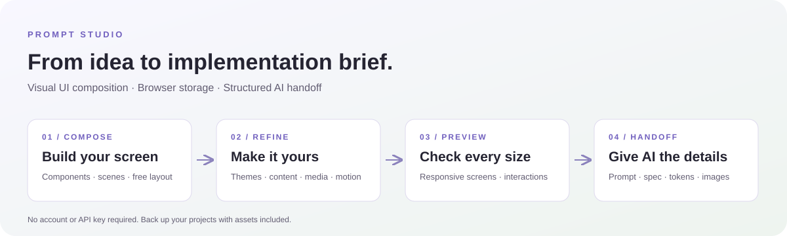
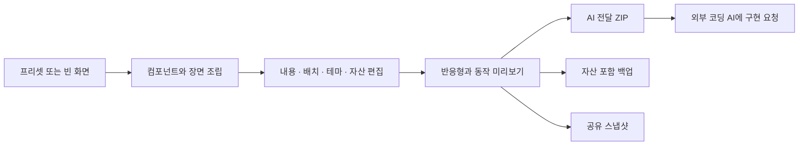

# Prompt Studio

**아이디어를 화면으로 만들고, 구현에 필요한 설계를 AI에 전달하세요.**

로그인 없이 UI를 조립하는 한국어 웹 편집기입니다. 컴포넌트와 장면을 배치하고, 테마·미디어·반응형 화면을 다듬은 뒤 프롬프트·설계 JSON·디자인 토큰·기준 이미지가 담긴 ZIP을 내보냅니다. 프로젝트와 업로드 파일은 사용자의 브라우저에 저장됩니다.



[사용 가이드](docs/USER_GUIDE.md) · [설치와 개발](docs/DEVELOPMENT.md) · [구조와 도식](docs/ARCHITECTURE.md) · [전체 문서](docs/README.md) · [GitHub 업로드](docs/GITHUB_UPLOAD.md)

이번 업로드본의 앱 소스는 [검증 기록](docs/VALIDATION.md)의 커밋을 기준으로 합니다. 같은 작업 공간에서 진행 중인 후속 기능은 검증이 끝난 뒤 별도 패키지로 갱신합니다.

## 화면 미리보기


현재 소스의 정적 빌드를 Microsoft Edge에서 실행해 캡처한 브랜드 랜딩 편집 화면입니다. [화면과 이미지 설명](docs/images/README.md)에서 추가 화면과 제작 방법을 확인할 수 있습니다.

## 주요 기능

| 기능        | 지원 범위                                                              |
| ----------- | ---------------------------------------------------------------------- |
| 화면 조립   | 삽입 항목 224개, 시작 프리셋 25개, 독립 자식으로 구성된 장면 12종      |
| 직접 편집   | 자동/자유 배치, 이동·크기·회전, 다중 선택, 정렬·간격·그룹, 실행 취소   |
| 내부 편집   | 제목·버튼·아이콘·SVG·표 셀·미디어 컨트롤을 부분별로 수정               |
| 테마        | 라이트·다크 테마 12쌍, 요소 외형 8종, 디자인 팩 T01~T08                |
| 반응형      | 390·768·1440px 미리보기, 직접 입력 320~2560px, 화면별 속성 상속        |
| 자산        | 이미지·영상·음성·WOFF2 서체·VTT 자막 등록, 교체, 자산 포함 ZIP 백업    |
| 콘텐츠      | 갤러리 항목, 챕터 탐색, 여러 단계 폼, 서식 본문 편집                   |
| 모션        | CSS 효과 12종과 런타임 효과 4종, 시작 조건·시간·강도·반복, 재생 제어   |
| 저장과 복구 | IndexedDB 자동 저장, 탭별 미저장 복구, 저장 충돌 검출, 수동 체크포인트 |
| AI 전달     | 프롬프트, 구조 명세, DTCG 토큰, CSS, PNG, 자산, SHA-256 manifest ZIP   |
| 공유        | 압축 URL 스냅샷, 읽기 전용 뷰어, 다른 브라우저에 사본 저장             |

수량은 현재 소스 기준입니다. 루트를 포함한 컴포넌트 정의는 225개이며, 외형 조합을 별도 컴포넌트로 중복 계산하지 않습니다. [진행 계획](docs/ROADMAP.md)에서 구현된 기능과 후속 목표를 구분합니다.

## 빠른 시작

Node.js 24.x와 npm을 기준으로 개발·검증합니다. 설치된 Next.js 안내의 최소 Node.js 요구사항은 20.9입니다. 환경 변수와 API 키는 필요하지 않습니다.

```sh
npm ci
npm run dev
```

브라우저에서 `http://localhost:3000`을 엽니다. `package-lock.json`으로 의존성을 고정합니다. 빌드 시 `next/font/google`의 Geist 서체를 받으므로 네트워크 연결이 필요할 수 있습니다.

정적 프로덕션 빌드를 실행하려면:

```sh
npm run build
npm start
```

`npm start`는 빌드된 `out/`을 `http://127.0.0.1:3200`에서 확인하는 로컬 서버입니다. 배포 대상은 `out/`의 내용입니다. [배포 안내](docs/DEPLOYMENT.md)를 참고하세요.

## 사용 흐름



1. **새 프로젝트**에서 프리셋 또는 빈 페이지·자유 캔버스를 고릅니다.
2. 왼쪽 라이브러리에서 요소를 추가하고, 캔버스와 오른쪽 속성 패널에서 편집합니다.
3. **테마**와 **자산** 탭에서 색상·서체·미디어를 설정합니다.
4. 화면 폭을 바꾸고 **미리보기**에서 탭·폼·미디어·모션을 확인합니다.
5. **AI에 전달**에서 프롬프트를 복사하거나 ZIP을 다운로드합니다.

AI 전달 ZIP은 구현 지시와 설계 자료입니다. 앱 내부의 AI 코드 생성, 인증·결제·서버 데이터 연결은 현재 범위에 포함되지 않습니다. 미리보기 폼과 대화는 샘플 동작입니다.

## 저장·백업·공유

| 방법               | 설계 데이터 | 업로드한 원본 파일          | 용도                           |
| ------------------ | ----------- | --------------------------- | ------------------------------ |
| 브라우저 자동 저장 | 포함        | 브라우저에 보관             | 같은 출처·프로필에서 계속 편집 |
| 프로젝트 JSON      | 포함        | 미포함                      | 설계 파일 교환                 |
| 자산 포함 ZIP 백업 | 포함        | 포함                        | 다른 기기·브라우저로 작업 이동 |
| 공유 링크          | 포함        | 미포함                      | 발행 시점의 설계 사본 미리보기 |
| AI 전달 ZIP        | 포함        | 포함, 누락 시 내보내기 오류 | 외부 AI에 구현 자료 전달       |

브라우저 데이터 삭제나 출처·프로필 변경 시 프로젝트가 자동으로 옮겨지지 않습니다. 중요한 작업은 **자산 포함 ZIP 백업**으로 보관하세요. 공유 링크를 가진 사람은 설계를 읽고 복제할 수 있으며, 링크 회수·만료 기능은 없습니다. [데이터 안내](docs/DATA_AND_PRIVACY.md)에 저장 위치·복구·제한을 정리했습니다.

## 기술과 구조

Next.js **16.3.7** · React **19.2.8** · TypeScript · Tailwind CSS 4 · Zod · IndexedDB · Playwright · JSZip · Motion · Radix/shadcn UI

```text
prompt-studio/
├── src/app/                  # /, /studio/, /view/, /legacy/
├── src/builder/              # 현재 편집기, 문서 모델, 렌더러, 저장, 전달
├── src/builder/vendor/shadcn/# 출처·라이선스를 보존한 UI 소스
├── src/components/          # 기존 데모 컴포넌트
├── src/studio/              # 기존 데모 문서 모델
├── src/data/                # 기존 디자인 참고 데이터
├── src/lib/                 # 기존 프롬프트·색상 도구
├── public/                  # 미디어·프리셋 이미지·라이선스
├── tests/                   # 단위 검사, 브라우저 검사, 고정 입력 자료
├── scripts/                 # 정적 서버·이미지 생성·GitHub 패키징
├── docs/                    # 사용·구조·개발·배포·도식·기존 계획
└── .github/                 # CI, 이슈 양식, PR 양식
```

현재 문서 스키마는 **v5**입니다. v2/v3/v4 문서는 읽을 때 변환하고 첫 저장 시 원본을 체크포인트로 보존합니다. 기존 앱은 `/legacy/`에 있습니다. 모델과 저장 흐름은 [아키텍처](docs/ARCHITECTURE.md), 파일 형식은 [AI 전달 명세](docs/AI_HANDOFF.md)에 설명합니다.

## 검증

```sh
npm test
npm run lint:studio
npm run build
npm run typecheck
```

깨끗한 설치에서는 `build`로 Next.js 라우트 타입을 생성한 뒤 `typecheck`를 실행합니다. 브라우저 검사 준비·정적 검사·성능 측정·현재 확인 결과는 [테스트 안내](docs/TESTING.md)에 있습니다. 전체 `npm run lint`에는 보존된 기존 데모의 진단이 남아 있어 현재 편집기 검사는 `lint:studio`를 사용합니다.

## GitHub에 올리기

```sh
npm run package:github
```

`github-upload/prompt-studio/`에 업로드용 소스, `github-upload/prompt-studio-github.zip`에 같은 내용의 압축 파일이 생성됩니다. `.git`, 의존성, 빌드, 테스트 결과, 환경 파일, 기존 호스팅 설정은 제외됩니다. 폴더 안의 `README.md`, `package.json`, `src/`, `.github/`가 새 저장소의 루트에 오도록 올리세요. [업로드 안내](docs/GITHUB_UPLOAD.md)에 Git과 GitHub Desktop 절차가 있습니다.

## 기여와 출처

[기여 안내](CONTRIBUTING.md) · [보안 안내](SECURITY.md) · [변경 기록](CHANGELOG.md) · [외부 소스와 자산 출처](THIRD_PARTY_NOTICES.md)

이 프로젝트 자체의 배포 라이선스는 아직 지정되지 않았습니다. 포함된 shadcn/ui와 Motion의 MIT 허가문은 원문을 보존합니다. 프로젝트 소유자가 전체 라이선스를 결정하기 전까지 이 README에 별도의 오픈소스 라이선스를 선언하지 않습니다.
