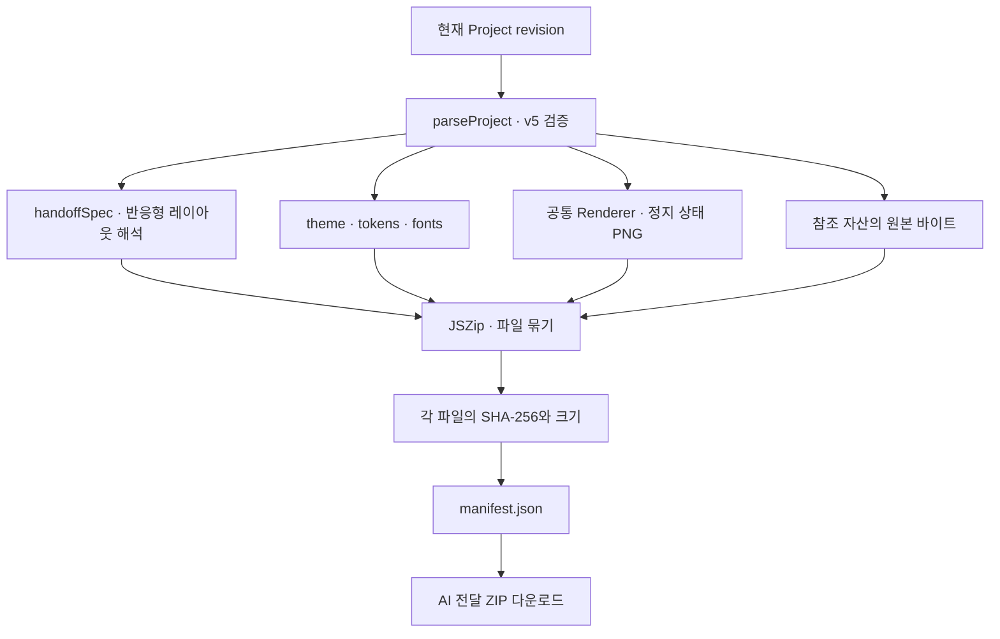

# AI 전달 자료

**AI에 전달**은 설계와 기준 이미지를 외부 코딩 AI가 읽을 수 있는 자료로 묶습니다. 완성된 앱 소스 코드와 배포 ZIP은 별도 결과물입니다.

## 생성 흐름



구조 명세의 현재 형식은 `prompt-studio-handoff`, version 3, rendererVersion `5.0.0`입니다. 원본 `project.json`의 schemaVersion 5와는 별도 버전입니다.

## 파일 목록

| 파일                     | 역할                                             |
| ------------------------ | ------------------------------------------------ |
| `START_HERE.md`          | 읽는 순서와 적용 규칙                            |
| `PROMPT.md`              | 사람이 읽는 구현 요청                            |
| `project.json`           | 스튜디오에서 다시 열 수 있는 원본                |
| `ui-spec.json`           | 페이지·노드·해석된 레이아웃·모션·동작 정의       |
| `theme.json`             | 라이트·다크를 포함한 실제 테마                   |
| `theme.tokens.json`      | DTCG 2025.10 형식의 원시·모드·의미·컴포넌트 토큰 |
| `theme.css`              | 현재 모드의 CSS 변수와 업로드 서체 경로          |
| `component-specs.json`   | 사용한 컴포넌트의 속성·상태·키보드·동작          |
| `component-sources.json` | vendored shadcn 소스 출처                        |
| `reference.css`          | 실제 미리보기 스타일 참고                        |
| `assets/manifest.json`   | 자산 메타데이터와 원본 연결                      |
| `assets/<asset-id>`      | 업로드·내장 자산의 원본                          |
| `screenshots/`           | 선택한 페이지·폭의 기준 PNG                      |
| `ACCEPTANCE.md`          | 구조·화면·동작 확인 항목                         |
| `manifest.json`          | revision·모드·캡처 조건·파일별 크기와 SHA-256    |

캡처 선택에 따라 이미지 수는 달라집니다. 외부 HTTPS 이미지 URL은 자산 보관함에 등록한 원본과 다르며 ZIP에 원본이 자동 포함되지 않습니다. 누락된 로컬 자산은 완전한 백업처럼 내보내지 않고 오류를 알립니다.

## 구현 요청 예시

```text
첨부 ZIP의 START_HERE.md부터 읽고 PROMPT.md를 실행하세요.
ui-spec.json의 페이지·children 순서·resolvedLayouts·동작을 따르세요.
theme.tokens.json과 theme.css의 실제 색상·서체·간격을 사용하세요.
screenshots는 같은 폭의 시각적 비교 자료로 사용하세요.
인증·결제·데이터 연결처럼 샘플인 동작은 구현 전 요구사항을 구분하세요.
390·768·1440px에서 구조·넘침·키보드 조작을 확인하세요.
```

## 명세 적용 규칙

- 구조·실제 값·동작 명세를 기준으로 하고 이미지는 시각적 확인에 사용합니다.
- `resolvedLayouts`의 gap·padding·margin에는 density가 이미 적용되어 있으므로 다시 곱하지 않습니다.
- 기준 폭은 390·768·1440px이고 반응형 전환점은 768·1024px입니다.
- `asset:asset-<sha256>` 참조는 자산 메타데이터와 `assets/<id>`로 해석합니다.
- 편집 선택 UI는 구현할 제품에 포함하지 않습니다.
- PNG는 작성된 속성과 기본 동작 상태를 정지한 기준입니다. 임의의 미리보기 실행 상태 전체를 저장한 이미지로 해석하지 않습니다.

외부 AI의 결과는 별도 검토가 필요합니다. 현재 프로젝트 기록에는 실기기와 외부 AI의 독립 재현 평가를 완료한 결과가 없습니다.
