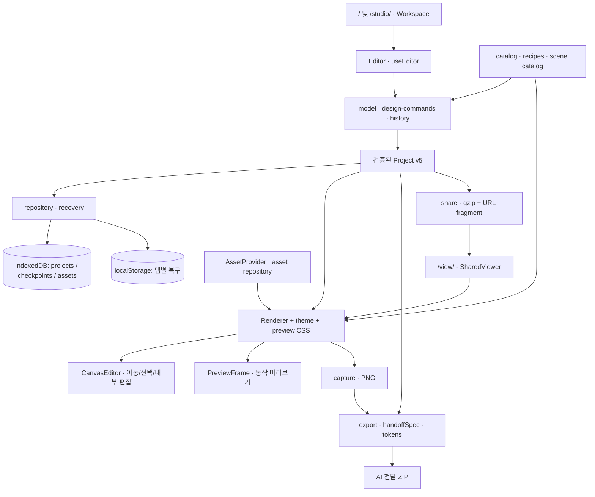
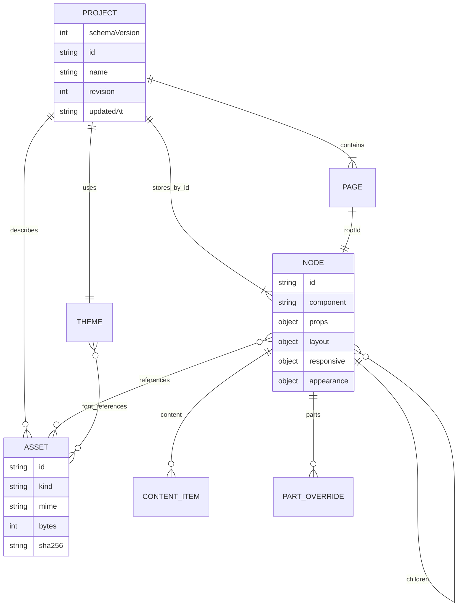
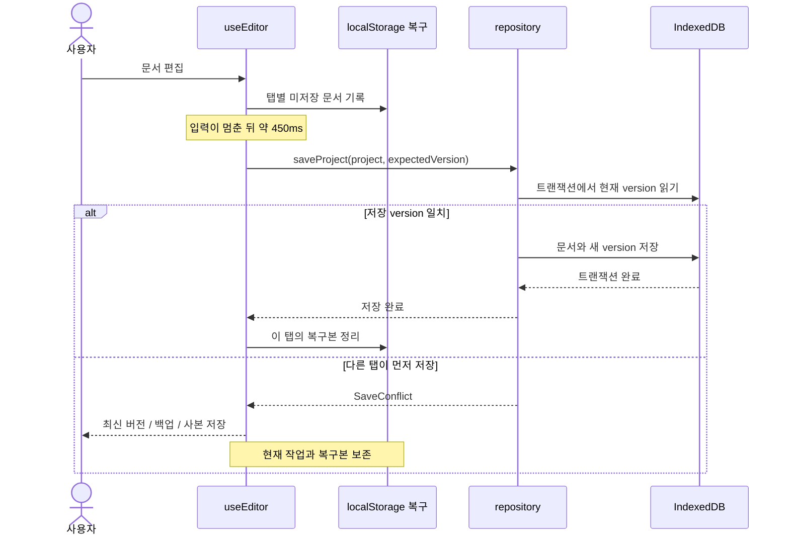

# 아키텍처

현재 편집기는 `src/builder/`에 있으며 Next.js App Router로 정적 HTML·JS·CSS를 출력합니다. 저장·편집·캡처·공유는 브라우저에서 실행됩니다. 문서 형식은 v5입니다.

## 전체 구조

공통 렌더러는 편집·미리보기·캡처·공유에 사용됩니다. AI 명세는 같은 문서의 해석된 레이아웃과 등록부 정의를 사용하고 기준 캡처를 묶습니다. `/legacy/`는 기존 데모입니다.

## 문서 관계

`CONTENT_ITEM`·`PART_OVERRIDE`는 설명용 이름입니다. 실제 JSON은 `node.content`·`node.parts`에 저장합니다. 자산 원본 바이트는 별도 IndexedDB 기록에 있습니다.

- `Project.nodes`는 ID 기반 맵이며 `Page.rootId`부터 트리로 순회합니다.
- 등록된 컴포넌트·속성과 허용 값만 읽습니다. 순환·중복 부모·누락 자식·고아 요소를 거부합니다.
- 기본 `layout` 위에 `responsive.tablet`·`responsive.desktop`을 적용합니다.
- 내부 부분은 `slot.*` 역할 또는 기존 `p.*` DOM 경로로 연결합니다.
- `appearance`는 렌더러·외형·모션, `content`는 고유 ID가 있는 항목 목록입니다.
- `schemaVersion`은 파일 형식, `revision`은 편집 revision, 저장 기록의 `version`은 탭 충돌 검사값입니다.

## 저장 흐름

v2/v3/v4를 v5로 읽고 처음 저장할 때 원본을 체크포인트로 함께 보존합니다. IndexedDB 이름의 `v2`는 파일 스키마를 뜻하지 않습니다. DB 버전과 파일 스키마는 독립적입니다.

## 핵심 파일

| 영역                 | `src/builder/` 아래 파일                                        |
| -------------------- | --------------------------------------------------------------- |
| 작업 공간            | `Workspace.tsx`, `Editor.tsx`                                   |
| 문서와 검증          | `model.ts`, `design-schema.ts`, `part-schema.ts`                |
| history·자동 저장    | `use-editor.ts`                                                 |
| 좌표·드래그·정렬     | `CanvasEditor.tsx`, `geometry.ts`, `design-commands.ts`         |
| 내부 부분 편집       | `PartsPanel.tsx`, `component-parts.tsx`                         |
| 등록부·조합 구조     | `catalog.ts`, `*-catalog.ts`, `component-recipes.ts`            |
| 시작 프로젝트        | `templates.ts`, `template-recipes.ts`, `pack-templates.ts`      |
| 공통 렌더링          | `Renderer.tsx`, `PreviewFrame.tsx`, `preview-css.ts`            |
| 테마·팩·토큰         | `theme.ts`, `tokens.ts`, `design-packs.ts`                      |
| 자산 검사와 보관     | `asset-model.ts`, `asset-repository.ts`, `AssetProvider.tsx`    |
| 모션                 | `motion-settings.ts`, `motion-runtime.ts`, `MotionPlayback.tsx` |
| 저장·체크포인트·복구 | `repository.ts`, `recovery.ts`                                  |
| 자산 ZIP 백업        | `project-archive.ts`                                            |
| AI 전달·기준 이미지  | `export.ts`, `component-specs.ts`, `capture.tsx`                |
| URL 스냅샷 공유      | `share.ts`, `SharedViewer.tsx`                                  |

기존 데모의 `src/studio/`, `src/components/`, `src/data/`, `src/lib/`는 보존합니다. shadcn 포털과 반응형 조회는 해당 iframe 문서를 사용하도록 조정했습니다.

Tailwind 입력 `src/builder/studio-ui.css`에서 `public/studio-ui.css`를 생성하며 iframe과 PNG가 같은 결과를 읽습니다. 생성 CSS는 Git에 포함하지 않고 `dev`·`build`에서 만듭니다.

새 모션 효과는 미리보기에서 `motion/mini`를 지연 로딩합니다. 편집·PNG·움직임 감소에서는 원래 콘텐츠를 정지 상태로 사용합니다. [모션 구현 기록](MOTION_RUNTIME.md)에 세부 범위가 있습니다.
