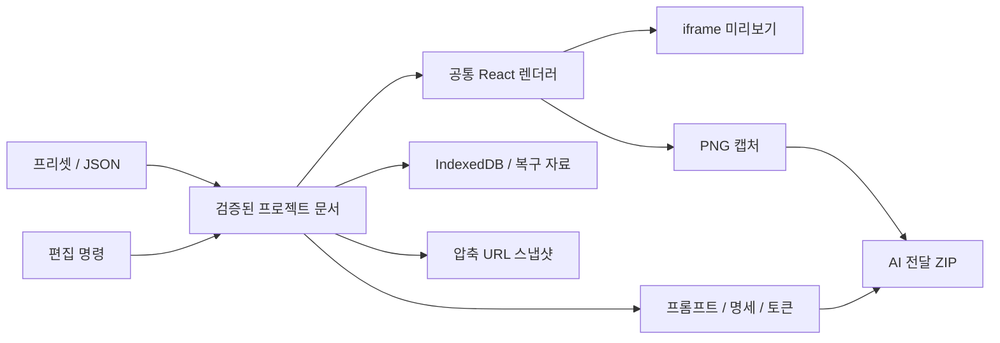

# 아키텍처

## 실행 구조

Next.js App Router를 정적 내보내기 모드로 빌드합니다. 현재 편집·저장·공유 해석·캡처는 브라우저에서 실행합니다. 서버 API, 사용자 계정, 프로젝트 클라우드 DB는 없습니다.

## 경로와 모듈

| 경로                                                                       | 책임                             |
| -------------------------------------------------------------------------- | -------------------------------- |
| `src/app/page.tsx`, `studio/page.tsx`                                      | 현재 작업 공간의 진입점          |
| `src/app/view/page.tsx`                                                    | 읽기 전용 공유 화면              |
| `src/app/legacy/`                                                          | 기존 앱 보존                     |
| `src/builder/model.ts`                                                     | Zod 스키마, 구조 검증, 트리 명령 |
| `catalog.ts`, `extended-catalog.ts`                                        | 컴포넌트 정의·기본값·편집 필드   |
| `ComponentThumbnail.tsx`, `library.ts`                                     | 작은 예시와 쉬운 설명            |
| `templates.ts`, `template-recipes.ts`                                      | 편집 가능한 프리셋 생성          |
| `Renderer.tsx`, `ExtendedContent.tsx`, `preview-css.ts`, `extended-css.ts` | 공통 화면 렌더링                 |
| `PreviewFrame.tsx`, `viewport.ts`                                          | iframe과 실제 CSS 화면 폭        |
| `theme.ts`, `tokens.ts`                                                    | 테마 값·CSS 변수·토큰 출력       |
| `use-editor.ts`                                                            | 편집 상태, 실행 취소, 자동 저장  |
| `repository.ts`, `recovery.ts`                                             | 저장, revision 충돌, 버전, 복구  |
| `share.ts`, `SharedViewer.tsx`                                             | 공유 URL 생성·해석               |
| `export.ts`, `component-specs.ts`, `capture.tsx`                           | AI 전달과 이미지 출력            |

표의 파일명만 있는 항목은 `src/builder/` 기준입니다. `src/components`, `src/data`, `src/lib`, `src/studio`는 기존 데모에서 사용하는 코드를 포함합니다. 현재 편집기 개선은 `src/builder`를 중심으로 합니다.

## 문서 모델

현재 파일의 `schemaVersion`은 2입니다.

| 필드                               | 의미                                      |
| ---------------------------------- | ----------------------------------------- |
| `id / name / revision / updatedAt` | 프로젝트 식별과 저장 충돌 판단            |
| `pages`                            | 페이지 이름·경로·rootId                   |
| `nodes`                            | ID로 찾는 중첩 노드와 children 순서       |
| `theme`                            | 실제 라이트·다크 색상, 서체, 밀도, 모서리 |

각 노드는 컴포넌트 ID, 원시 속성, 자식 ID, 기본 레이아웃, 화면별 변경값, 숨김·잠금을 가집니다. 현재 props 값은 문자열·유한 숫자·불리언입니다. 임의 객체·배열·JavaScript를 직접 실행하는 속성은 지원하지 않습니다.

검증은 스키마뿐 아니라 중복 부모, 순환, 잘못된 참조, 깊이와 전체 크기도 다룹니다. 주요 제한은 30페이지, 2,000노드, 깊이 24, 가져오기 3,000,000바이트입니다. 한 노드의 children은 최대 500개입니다.

선택적 레이아웃 필드가 없는 기존 schemaVersion 2 파일은 기본값으로 해석합니다. v1 자동 변환이나 알 수 없는 미래 컴포넌트의 부분 복원은 구현되지 않았습니다.

## 반응형과 테마

기본 레이아웃 위에 768px 이상에서 tablet, 1024px 이상에서 desktop 변경값을 순서대로 합칩니다. 화면 폭과 프레임 확대 배율을 분리합니다.

테마는 프리셋 이름만 저장하지 않고 실제 값을 보관합니다. 밀도는 gap·padding·margin에 적용됩니다. AI 명세의 `resolvedLayouts`에는 이미 밀도가 반영되어 있으므로 소비자가 다시 곱하면 안 됩니다.

## 저장과 공유

IndexedDB 쓰기 시 예상 revision과 실제 revision을 비교해 다른 탭의 변경을 감지합니다. 자동 저장은 수정 후 450ms 지연되며 탭별 복구 자료를 별도로 남깁니다. 복구 자료는 계정 동기화나 서버 백업이 아닙니다.

공유는 검증된 JSON을 gzip 후 base64url로 바꾸어 `#design=v2.` 뒤에 넣습니다. 공유 fragment 최대 길이는 12,000자, 압축 해제 후 최대 크기는 3,000,000바이트입니다. 압축은 암호화가 아닙니다.

## 화면과 캡처 일치

프리셋 큰 미리보기·편집 화면·공유 화면·PNG는 같은 렌더러를 사용합니다. 캡처에서는 편집 테두리와 움직임을 제거합니다. ZIP 기준 이미지는 각 페이지의 세 표준 폭, 단일 PNG는 현재 사용자 지정 폭을 사용할 수 있습니다.

편집 시 변경되지 않은 컴포넌트 본문을 재사용하고 화면 밖의 단순 텍스트에 content-visibility를 적용합니다. 읽기 전용·캡처에는 편집 모드의 이 최적화가 적용되지 않습니다. WebKit 대형 문서 성능은 [남은 과제](TESTING.md)입니다.
