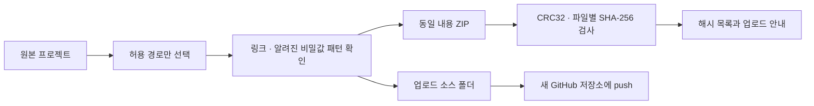

# GitHub 업로드 안내

이 패키지는 바로 새 저장소에 올릴 수 있는 소스와 문서를 담습니다. GitHub 원격 저장소 생성과 실제 push는 사용자 계정에서 실행합니다.

## 패키지 생성

```sh
npm ci
npm run package:github
```

기본 폴더가 이미 있으면 덮어쓰지 않습니다. 다음 사본은 새 이름으로 만드세요.

```sh
npm run package:github -- --name prompt-studio-v2
```

폴더를 생성하지 않고 링크·비밀값 표식·ZIP의 바이트 일치만 검사하려면 `npm run package:github -- --check`를 사용합니다.

현재 제공한 업로드본은 병행 수정 중인 앱 코드가 섞이지 않도록 [검증 기록](VALIDATION.md)의 커밋을 사용했습니다. 같은 기준의 사본은 원본 Git 작업 공간에서 `npm run package:github -- --ref d27c88cc0486882109c74be58ed95f7ed3743c9b --name prompt-studio-v2`로 만들 수 있습니다. `--ref`는 `src/`, `public/`, 기존 `scripts/`, `tests/`와 package·lockfile을 해당 커밋에서 읽고 새 문서·GitHub 설정·패키징 명령은 현재 파일을 사용합니다. 기본 명령은 실행 시점의 working tree를 복사합니다.

## 패키지 구조

```text
github-upload/
├── prompt-studio/             ← 이 안의 내용을 저장소 루트에 올리기
│   ├── README.md
│   ├── package.json
│   ├── package-lock.json
│   ├── src/ public/ tests/ scripts/ docs/
│   ├── .github/
│   └── .gitignore 및 개발 설정
├── prompt-studio-github.zip   ← 위 폴더의 동일 내용, 이동·보관용
├── prompt-studio.manifest.json← 파일별 SHA-256·크기·제외 목록
└── prompt-studio-UPLOAD.md    ← 빠른 업로드 안내
```



ZIP 파일 자체를 저장소에 올리면 README와 코드가 압축 안에 머뭅니다. 압축을 풀어 `prompt-studio/`의 **내용**을 올리세요. `github-upload/` 전체를 올리는 방식은 소스 폴더를 한 단계 더 감싸므로 사용하지 않습니다.

## Git으로 한 번에 업로드

1. GitHub에서 `prompt-studio` 같은 이름으로 새 저장소를 만듭니다.
2. README·라이선스·gitignore 자동 생성은 선택하지 않아 빈 저장소로 시작합니다.
3. PowerShell에서 업로드 폴더로 이동하고 아래 명령을 실행합니다.

```powershell
cd .\github-upload\prompt-studio
git init -b main
git add .
git commit -m 'Prepare Prompt Studio source and documentation'
$repositoryUrl = Read-Host '새 GitHub 저장소의 HTTPS URL'
git remote add origin $repositoryUrl
git push -u origin main
```

Git의 사용자 이름·이메일과 GitHub 인증이 설정되어 있어야 합니다. 원본 작업 공간의 기존 Git remote를 바꾸지 않고 새 복사본에서 실행합니다. 이미 파일이 있는 저장소는 해당 저장소를 clone하고 소스 내용을 복사해 일반 커밋으로 추가하세요.

## GitHub Desktop 사용

GitHub Desktop에서 새 로컬 저장소를 만든 뒤 업로드 폴더의 내용을 해당 저장소 루트로 복사합니다. `.github`, `.gitignore`, `.gitattributes`, `.editorconfig`도 포함하세요. 변경 목록을 확인하고 커밋한 뒤 **Publish repository**로 게시합니다. 저장소 이름과 공개 여부는 계정에서 선택합니다.

## 웹에서 파일 업로드

파일 수가 많으므로 Git 또는 Desktop 방식이 편합니다. GitHub 웹 업로드는 한 번에 100개 파일, 파일당 25MiB 제한이 있습니다. 웹으로 올리려면 폴더 구조를 유지해 나누어 업로드하고 숨김 파일 누락을 확인하세요. Git 전송도 100MiB를 초과한 개별 파일은 제한됩니다. [GitHub 공식 파일 추가 안내](https://docs.github.com/en/repositories/working-with-files/managing-files/adding-a-file-to-a-repository)를 기준으로 정리했습니다.

## 포함·제외 기준

| 포함                           | 이유                       |
| ------------------------------ | -------------------------- |
| 전체 소스와 테스트·고정 자료   | 실행·검증·이전 파일 호환성 |
| package와 lockfile·개발 설정   | 같은 의존성으로 설치       |
| public 미디어와 프리셋 이미지  | 미리보기와 샘플 장면       |
| README·문서·도식·라이선스 출처 | 저장소 소개와 유지 관리    |
| .github CI·이슈·PR 양식        | 기본 검사와 협업           |

| 제외                                                | 이유                            |
| --------------------------------------------------- | ------------------------------- |
| `.git/`                                             | 기존 이력·remote·로컬 설정      |
| `node_modules/`, `.next/`, `out/`                   | 설치·빌드로 재생성              |
| `artifacts/`, `test-results/`, `playwright-report/` | 로컬 검사 결과와 진단           |
| `.env*`, private key 파일, 에디터·OS 파일           | 로컬 설정                       |
| `.openai/`, `scripts/publish-source.mjs`            | 기존 Sites 배포 연결            |
| `next-env.d.ts`, `*.tsbuildinfo`, 생성 CSS          | Next·TypeScript·Tailwind 재생성 |
| `github-upload/`                                    | 패키지의 재귀 포함 방지         |

원본 폴더와 복사본 사이에 symbolic link를 만들지 않습니다. 알려진 비밀값 패턴 검사는 대표적인 토큰·private key 표식을 찾는 제한된 검사이며 모든 형태의 민감정보를 판정하는 도구는 아닙니다. 검출 시 내용을 출력하지 않고 해당 파일 경로만 알려줍니다.

## 올린 뒤 확인

- 저장소 첫 화면에 README와 PNG·SVG가 표시되는지 확인합니다.
- docs 링크와 Mermaid 도식을 확인합니다.
- `.github/workflows/ci.yml`의 기본 검사 실행 결과를 확인합니다.
- 별도 clone에서 `npm ci`, `npm run build`, `npm run typecheck`를 실행합니다.
- 저장소 소개에 다음 문구와 토픽을 사용할 수 있습니다.

설명 예시: `로그인 없이 UI를 조립하고 반응형 설계·토큰·이미지를 AI 구현 자료로 전달하는 웹 편집기.`

토픽 예시: `ui-builder`, `design-tools`, `prompt-engineering`, `nextjs`, `react`, `typescript`, `design-tokens`, `local-first`.

CI는 [공식 checkout](https://github.com/actions/checkout)과 [setup-node](https://github.com/actions/setup-node)의 v7을 사용하며 읽기 권한으로 기본 검사를 실행합니다. 사이트 배포와 npm 패키지 발행은 설정하지 않습니다. 프로젝트 전체 라이선스는 아직 지정하지 않았으며 외부 허가문은 [출처 문서](../THIRD_PARTY_NOTICES.md)에 보존합니다.
