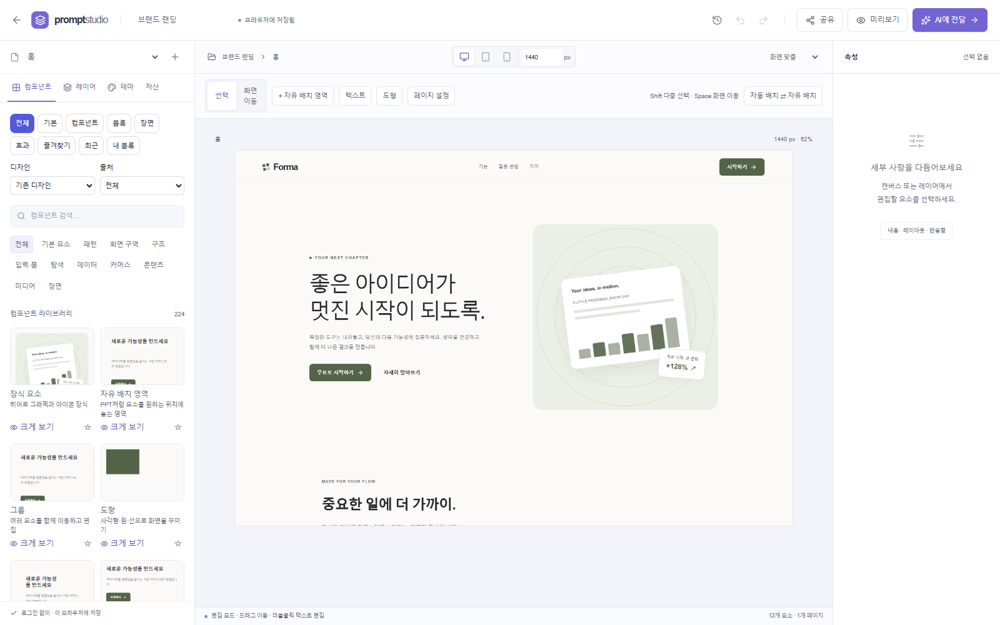
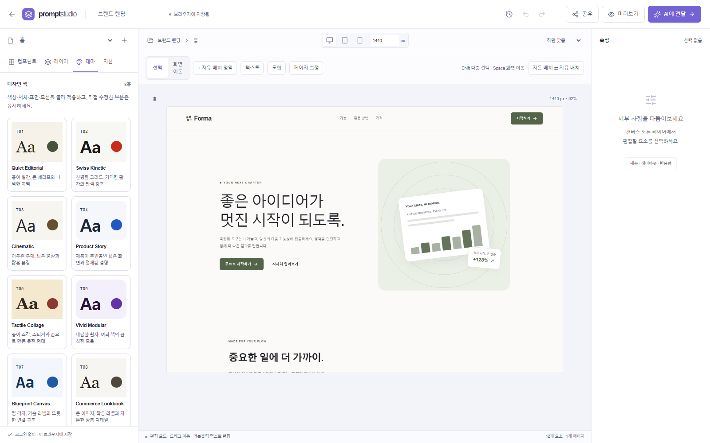

# 화면과 이미지

## 실제 화면





두 PNG는 2026-10-07 현재 소스의 정적 빌드를 Microsoft Edge에서 실행해 새 샘플 프로젝트로 캡처합니다. 개인 저장소나 기존 사용자의 설계는 사용하지 않습니다.

## 제작 방법

`npm run build` 후 별도 터미널에서 `npm start`를 실행하고 다음 명령을 사용합니다.

```sh
npm run docs:screenshots
```

기본 주소는 `http://127.0.0.1:3200`이며 `STUDIO_DOCS_URL`로 변경할 수 있습니다. `scripts/docs-screenshots.ts`가 두 PNG를 생성합니다. `project-overview.svg`는 직접 작성한 개요 이미지입니다. 기술 도식의 편집 가능한 원본은 각 문서의 Mermaid 블록입니다.
