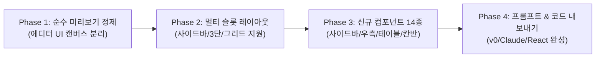

# 🎨 [기능 혁신 설계안] 순수 실시간 미리보기 & 다중 영역(사이드바/3단/그리드) 자유 배치 시스템

---

## 📌 1. 문제 분석 및 목표 정의

### 현재 시스템의 2대 한계점
1. **미리보기의 몰입감 저해 (에디터 UI의 캔버스 침범)**
   - 캔버스 내부에 `🧱 레고 블록 스택: N개 블록...`, 각 컴포넌트마다 `BLOCK 01`, `[위로] [아래로] [삭제]` 툴바, 하단 `+ 새 레고 블록 끼워넣기` 점선 버튼 등이 직접 노출되어 실제 서비스 웹사이트/앱의 느낌이 나지 않음.
2. **단순 1차원 세로 스택 (`flex-col`) 구조의 한계**
   - 모든 컴포넌트가 위에서 아래로만 일렬로 쌓이는 구조로 인해 현대 웹/앱의 핵심인 **사이드바(Sidebar)**, **3단 분할(Holy Grail: 사이드바 + 메인 + 우측 패널)**, **2열/3열 그리드 분할**, **대시보드 위젯 배치**가 불가능함.

### 핵심 목표
1. **100% 무결점 '순수 미리보기(Pure Live Preview)' 구현**
   - 캔버스 내부에서 모든 디버그/편집용 요소를 완전히 격리하고, 실제 프로덕션 수준의 웹/앱 화면만 렌더링.
   - 편집 제어는 **좌측 컨트롤러 패널** 및 **캔버스 상단 전용 툴바(미리보기 ↔ 인스펙트 토글)**로 일원화.
2. **자유 배치 멀티 슬롯(Multi-Zone Slots) 레이아웃 엔진 구축**
   - 단순 세로 스택을 넘어 **Header / Sidebar / Main / Aside / Footer** 슬롯 시스템 및 **Bento/Grid 컬럼 분할** 기능 도입.
3. **다양한 신규 컴포넌트 대폭 확장**
   - 사이드바 4종, 우측 패널 4종, 대시보드 인터랙티브 데이터 위젯 6종 추가.
4. **AI 프롬프트 & 코드 내보내기 연동**
   - 선택된 레이아웃 구조(Flex/Grid/Sidebar)가 v0, Claude 프롬프트 및 React 코드로 완벽하게 변환되도록 일관성 보장.

---

## 🏗️ 2. 아키텍처 개편 상세 설계

### A. 캔버스 렌더러 분리: '순수 미리보기' vs '인스펙트 모드'

```mermaid
flowchart TD
    ModeToggle["상단 뷰 모드 토글 (Pure Preview vs Inspect Mode)"]
    
    ModeToggle -->|Pure Preview (기본값)| Pure["💎 순수 실시간 미리보기<br/>• 편집 툴바 / 삭제 버튼 완전 제거<br/>• 실제 프로덕션 웹사이트와 100% 동일<br/>• 마우스 호버 시 인터랙션만 동작"]
    ModeToggle -->|Inspect Mode| Inspect["✏️ 블록 인스펙트 모드<br/>• 블록 외곽에 부드러운 가이드 라인<br/>• 마우스 오버 시에만 슬림 플로팅 액션 노출<br/>• 슬롯 이동 / 속성 수정 가능"]

    LeftPanel["좌측 스튜디오 컨트롤러<br/>(컴포넌트 탭)"] -->|순서 변경 / 추가 / 삭제 / 배치 슬롯 지정| Canvas["캔버스 렌더러"]
```

#### 세부 조치 사항:
- `CanvasRenderer.tsx` 내부의 `BLOCK 01 ... [위로][아래로][삭제]` 상단 바 완전 제거.
- `🧱 레고 블록 스택 ...` 상태 알림 바 제거.
- `+ 새 레고 블록 끼워넣기` 점선 박스를 캔버스에서 제거하고, **좌측 패널 및 상단 헤더 액션**으로 이동.
- 상단 툴바에 **뷰 모드 스위치** 추가:
  - `👁️ 미리보기 (Pure Preview)`: 캡처, 데모, 시각 검증용 무결점 뷰.
  - `✏️ 인스펙트 (Inspect)`: 디자이너가 구조를 파악할 수 있는 미세 가이드라인 제공.

---

### B. 다중 슬롯(Multi-Zone Slot) 레이아웃 아키텍처

화면 배치를 자유롭게 할 수 있도록 **5개 핵심 슬롯**과 **3대 레이아웃 모드**를 정의합니다.

```
┌────────────────────────────────────────────────────────────────────────┐
│                        1. HEADER / GNB SLOT                            │
├──────────────┬──────────────────────────────────────────┬──────────────┤
│              │          3. MAIN CONTENT SLOT            │              │
│  2. SIDEBAR  │  ┌──────────────────┬─────────────────┐  │   4. ASIDE   │
│     SLOT     │  │   Col 1 (50%)    │   Col 2 (50%)   │  │    SLOT      │
│              │  ├──────────────────┴─────────────────┤  │              │
│  (메뉴 트리, │  │          Full Width Row (100%)     │  │ (KPI 요약,   │
│   아이콘 독, │  ├──────────┬─────────────┬───────────┤  │  활동 피드,  │
│   필터 등)   │  │ Bento 1  │   Bento 2   │  Bento 3  │  │  위젯 스택)  │
│              │  └──────────┴─────────────┴───────────┘  │              │
├──────────────┴──────────────────────────────────────────┴──────────────┤
│                        5. FOOTER / DOCK SLOT                           │
└────────────────────────────────────────────────────────────────────────┘
```

#### 1) 4대 레이아웃 프리셋 (One-Click Archetypes)
1. **단일 랜딩 세로형 (`landing_single`)**:
   - `Header` -> `Main(1D Stack)` -> `Footer`
   - 마케팅 랜딩 페이지, 스토리텔링 쇼케이스에 최적화.
2. **사이드바 + 메인 대시보드 (`sidebar_main`)**:
   - `Sidebar (좌측 260px 고정)` + `Main (우측 전폭 콘텐츠)` + `상단 미니 헤더`
   - 현대적 SaaS, 관리자 페이지, 웹 애플리케이션의 글로벌 표준.
3. **3단 분할 홀리그레일 (`holy_grail_3col`)**:
   - `Left Sidebar (240px)` + `Center Main (피드/작업)` + `Right Aside (280px 요약/도구)`
   - Notion, Slack, Linear, Twitter(X), Figma 스타일 엔터프라이즈 워크스페이스.
4. **모듈러 벤토 스튜디오 (`bento_grid`)**:
   - 자유로운 12열 그리드 기반, 컴포넌트별 `col-span-12`, `col-span-8`, `col-span-4`, `col-span-6` 조합.

#### 2) 레고 블록 데이터 모델 확장 (`LegoBlockItem`)
```typescript
export type LayoutZoneSlot = 'header' | 'sidebar' | 'main' | 'aside' | 'footer';
export type GridColumnSpan = 'full' | 'half' | 'third' | 'two-thirds'; // 100%, 50%, 33%, 66%

export interface LegoBlockItem {
  instanceId: string;
  componentId: string;
  name: string;
  koreanName: string;
  focalAnchor: FocalAnchor;
  category: 'header' | 'hero' | 'body' | 'metric' | 'footer' | 'trust' | 'conversion' | 'sidebar' | 'aside';
  type: string;
  description: string;
  // 🌟 신규 자유 배치 필드
  targetSlot: LayoutZoneSlot; // 배치될 영역
  colSpan?: GridColumnSpan;   // 메인 슬롯 내 가로 너비 분할
}
```

---

### C. 신규 컴포넌트 라이브러리 확장 명세

현재 40여 종의 랜딩 위주 컴포넌트에서 **앱/대시보드/사이드바 필수 컴포넌트 14종을 신규 추가**합니다.

| 분류 | 컴포넌트 ID | 한글 명칭 | 주요 특징 |
|---|---|---|---|
| **사이드바 (4종)** | `sidebar-app-tree` | 📂 SaaS 계층형 메뉴 & 워크스페이스 사이드바 | 워크스페이스 스위처, 폴더 트리, 뱃지, 하단 프로필 |
| | `sidebar-icon-dock` | 🍱 미니멀 슬림 아이콘 독 (Figma/Apple) | 64px 폭, 툴팁 지원 아이콘 메뉴, 활성 상태 인디케이터 |
| | `sidebar-filter-facets` | 🔍 이커머스/검색 다면 필터 사이드바 | 가격대 슬라이더, 카테고리 체크박스, 태그 필터 칩 |
| | `sidebar-docs-nav` | 📑 도큐먼트 목차 & API 레퍼런스 트리 | 검색창 내장, 중첩 아코디언 목차, 버전 태그 |
| **우측 패널 (4종)** | `aside-activity-timeline` | ⚡️ 실시간 액티비티 타임라인 피드 | 이벤트 로그, 사용자 액션 기록, 타임스탬프 |
| | `aside-kpi-inspector` | 📊 인스펙터 속성 & 미니 KPI 게이지 | 활성 항목 메타데이터, 스파크라인, 미니 진행률 |
| | `aside-team-presence` | 👥 팀 협업 & 실시간 접속 멤버 리스트 | 온라인 아바타, 작업 중인 문서 태그, 빠른 멘션 |
| | `aside-widget-stack` | 🗓️ 캘린더 & 오늘 할 일 퀵 액션 위젯 | 미니 달력, 우선순위 태스크 체크리스트 |
| **메인 대시보드 (6종)** | `main-data-table` | 📋 인터랙티브 데이터 그리드 테이블 | 상태 뱃지, 아바타, 정렬 헤더, 인라인 액션, 페이지네이션 |
| | `main-kanban-board` | 📌 3열 프로젝트 칸반 보드 | To Do / In Progress / Done 태스크 카드 및 우선순위 라벨 |
| | `main-chart-suite` | 📈 복합 시계열 분석 차트 & 메트릭 | 멀티 축 꺾은선 차트 + 도넛 비율 차트 그리드 |
| | `main-split-settings` | ⚙️ 2열 프로필 & 보안 환경설정 폼 | 좌측 카테고리 설명 + 우측 스위치/인풋 폼 |
| | `main-feed-cards` | 💬 소셜 / 커뮤니티 타임라인 피드 | 프로필 아바타, 이미지 미디어, 좋아요/댓글 인터랙션 |
| | `main-bento-quad` | 🔲 4분할 벤토 인터랙티브 위젯 박스 | 2x2 반응형 인터랙티브 마이크로 기능 쇼케이스 |

---

### D. UI/UX 조작 인터페이스 혁신 (좌측 패널 개편)

1. **레이아웃 아키텍처 선택기 (상단)**:
   - `[랜딩 롱스크롤] | [사이드바 + 메인] | [3단 홀리그레일] | [벤토 그리드]` 탭 제공.
2. **슬롯별 블록 그룹핑 관리**:
   - `[상단 헤더]` (1개)
   - `[좌측 사이드바]` (사이드바 컴포넌트 배치)
   - `[중앙 본문]` (블록 순서 및 `[100% | 50% 반반 | 33% 3열]` 너비 조절)
   - `[우측 패널]` (보조 위젯 배치)
   - `[하단 푸터]` (1개)
3. **드래그 앤 드롭 및 원클릭 슬롯 이동**:
   - 각 블록에서 드롭다운으로 `사이드바로 이동`, `우측 패널로 이동`, `너비: 50%` 변경 가능.

---

### E. AI 프롬프트 엔진 및 코드 내보내기 동기화

- **v0 / Tailwind 코드 생성기**:
  - `sidebar_main` 선택 시:
    ```tsx
    <div className="flex min-h-screen">
      <aside className="w-64 border-r">{/* Sidebar Components */}</aside>
      <div className="flex-1 flex flex-col">
        <header>{/* Header */}</header>
        <main className="p-6 grid grid-cols-12 gap-6">{/* Main Components with col-span */}</main>
      </div>
    </div>
    ```
  - `holy_grail_3col` 선택 시:
    ```tsx
    <div className="flex min-h-screen">
      <aside className="w-60 border-r">{/* Left Sidebar */}</aside>
      <main className="flex-1 p-6">{/* Main Feed */}</main>
      <aside className="w-72 border-l">{/* Right Aside */}</aside>
    </div>
    ```
- **ChatGPT / Claude 프롬프트**:
  - 레이아웃 아키텍처 섹션(`<layout_architecture>`)을 자동으로 첨부하여 AI가 실제 사이드바 및 다단 분할 CSS 코드를 생성하도록 보장.

---

## 📅 3. 단계별 실행 로드맵 (Execution Phases)



### [Phase 1] 캔버스 순수화 (Pure Live Preview)
- `CanvasRenderer.tsx` 내의 디버그 툴바(`BLOCK 01`, `위로`, `아래로`, `삭제`), 레고 상태 바, `+ 새 블록 추가` 버튼을 캔버스 내부에서 완전 제거.
- 상단 네비게이션에 `[👁️ 순수 미리보기] / [✏️ 인스펙트]` 토글 추가.
- 모든 블록 제어(추가, 순서, 삭제)는 좌측 스튜디오 패널에서 깔끔하게 조작하도록 연결.

### [Phase 2] 멀티 슬롯 레이아웃 엔진 구현
- `LayoutPreset` (`landing`, `sidebar_main`, `holy_grail`, `bento`) 상태 추가.
- `LegoBlockItem`에 `targetSlot`과 `colSpan` 필드 추가.
- `CanvasRenderer.tsx`에서 선택된 레이아웃 프리셋에 따라 `Header`, `Sidebar`, `Main(Grid)`, `Aside`, `Footer`를 동적으로 배치하는 멀티존 렌더링 프레임워크 구축.

### [Phase 3] 사이드바 및 대시보드 신규 컴포넌트 구현
- `component-presets.ts`에 사이드바(4종), 우측 패널(4종), 메인 대시보드(6종) 등록.
- `CanvasRenderer.tsx`의 렌더러에 신규 컴포넌트의 실제 동작 UI(트리 메뉴, 필터 슬라이더, 데이터 테이블, 칸반 카드, 타임라인 등) 렌더링 코드 추가.
- 좌측 `컴포넌트 탭` 및 `LegoBlockStackerModal`에 사이드바/패널 필터 칩 추가.

### [Phase 4] AI 프롬프트 엔진 및 코드 내보내기 동기화
- `prompt-engine.ts`: 멀티 슬롯 및 사이드바 구조 지시문 추가.
- `CodeExportModal.tsx`: 선택된 레이아웃에 맞는 완벽한 반응형 Tailwind/React 코드 템플릿 출력.
- 최종 빌드 및 렌더링 검증.
